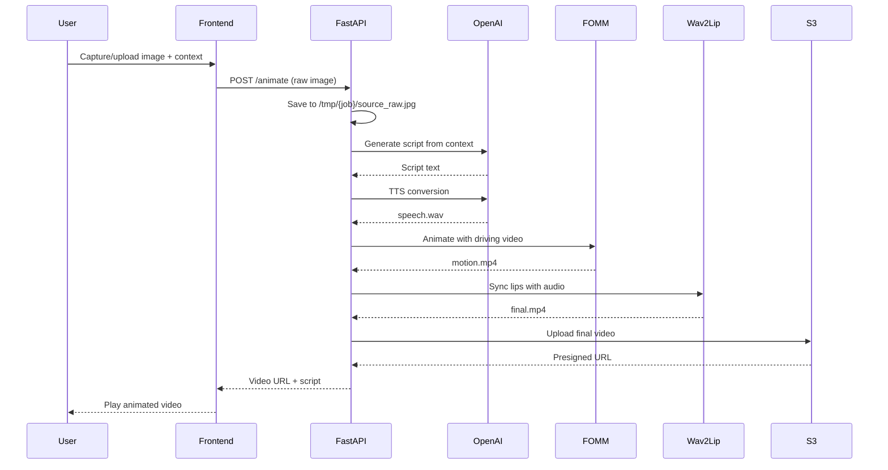

# Design Document

## Overview

The AI-Powered Talking Portrait Animation system is a web application that transforms static portrait images into animated talking videos. Built for rapid development and deployment, the system uses a streamlined approach with no preprocessing - users upload raw images and the system handles everything automatically using FOMM for motion, Wav2Lip for lip sync, and OpenAI for script generation and TTS.

### Key Design Principles
- **Hackathon-Ready**: Fast development with minimal complexity
- **No Preprocessing**: Raw image upload with automatic handling
- **Web-First**: Browser-based capture and upload for ease of use
- **Direct Pipeline**: Streamlined processing without complex queuing
- **MVP Focus**: Core functionality working quickly and cleanly

## Architecture

### High-Level Architecture

```mermaid
graph TB
    subgraph "Frontend"
        Camera[Camera Capture]
        Upload[Image Upload]
        Status[Status Polling]
        Player[Video Player]
    end
    
    subgraph "FastAPI Backend"
        API[/animate endpoint]
        Script[Script Generation]
        TTS[OpenAI TTS]
        FOMM[Motion Animation]
        Wav2Lip[Lip Sync]
        FFmpeg[Video Stitching]
    end
    
    subgraph "Storage"
        S3[AWS S3]
        Local[/tmp processing]
    end
    
    Camera --> API
    API --> Script
    Script --> TTS
    TTS --> FOMM
    FOMM --> Wav2Lip
    Wav2Lip --> FFmpeg
    FFmpeg --> S3
    S3 --> Player
    API --> Status
```

### Processing Pipeline



## Components and Interfaces

### Frontend Components (React + Tailwind)

#### Camera Capture Component
- **Purpose**: Capture photos directly in browser
- **Features**: 
  - `getUserMedia()` camera access
  - Canvas-based image capture
  - Direct blob upload (no preprocessing)
  - Simple context input field

#### Video Player Component
- **Purpose**: Display generated talking portraits
- **Features**:
  - HTML5 video player
  - Generated script display
  - Simple download/share options

#### Status Component
- **Purpose**: Show processing progress
- **Features**:
  - Simple loading indicator
  - Basic status messages
  - Error display

### Backend API (FastAPI)

#### Core Endpoint
```
POST /animate
- Multipart form data:
  - image: UploadFile (raw JPG/PNG)
  - context: str (user description)
  - motion_id: str (wave_5s, idle_5s, step_5s, lookaround_5s)
  - target_secs: int (default 5-8 seconds)
- Returns: {"status": "done", "script": "...", "video_url": "..."}

GET /status/{job_id} (optional for async)
- Returns: {"status": "running|done|error", "video_url": "...", "error": null}
```

### AI Integration Layer

#### OpenAI Integration (Simplified)
- **Script Generation**:
  - Direct context-to-script using OpenAI API
  - Simple prompt: "Write a {target_secs}-second script. Context: {context}"
  - No complex analysis - just generate engaging content

#### Text-to-Speech
- **OpenAI TTS**:
  - Model: `tts-1` or `gpt-4o-mini-tts`
  - Voice: `alloy` (default, can be configurable)
  - Format: WAV for compatibility
  - Direct text-to-audio conversion

### Animation Pipeline

#### FOMM (First Order Motion Model)
- **Technology**: Taichi-256 checkpoint for full-body animation
- **Process**:
  - Raw image input (no preprocessing)
  - Use `--relative --adapt_scale` flags for automatic scaling
  - Driving videos: 256x256 @ 24fps, 5-8 second clips
  - Output: motion.mp4

#### Driving Video Library
- **Pre-recorded motions** stored in `backend/driving/body/`:
  - `wave_5s_256.mp4` - friendly wave gesture
  - `idle_5s_256.mp4` - breathing/swaying motion
  - `step_5s_256.mp4` - small step in place
  - `lookaround_5s_256.mp4` - head turning left/right

#### Wav2Lip Synchronization
- **Technology**: Wav2Lip-HD for lip sync
- **Process**:
  - Input: motion.mp4 + speech.wav
  - Automatic face detection and lip sync
  - `--resize_factor 2` for small faces
  - Output: final.mp4

#### Video Processing
- **Technology**: FFmpeg (for future multi-clip stitching)
- **Current**: Single clip output
- **Future**: Concatenate multiple clips for longer videos

## Data Models (Simplified)

### Processing Job (In-Memory)
```python
# Simple job tracking in /tmp/{job_id}/
job_id = str(uuid.uuid4())
job_dir = f"/tmp/{job_id}"

# Files created during processing:
# - source_raw.jpg (uploaded image)
# - speech.wav (TTS output)
# - motion.mp4 (FOMM output)
# - final.mp4 (Wav2Lip output)
```

### API Response Models
```python
class AnimateResponse:
    status: str  # "done" | "error"
    script: str  # Generated script text
    video_url: str  # S3 presigned URL
    error: Optional[str]  # Error message if failed

class StatusResponse:  # For async version
    status: str  # "running" | "done" | "error"
    video_url: Optional[str]
    error: Optional[str]
```

## Error Handling (MVP)

### Basic Error Handling
- **File Upload Errors**: Return clear error messages for invalid formats
- **OpenAI API Errors**: Catch and return API error messages
- **FOMM/Wav2Lip Errors**: Catch subprocess errors and return generic failure message
- **S3 Upload Errors**: Handle upload failures gracefully

### Error Response Format
```python
{
    "status": "error",
    "error": "Clear error message for user",
    "video_url": null,
    "script": null
}
```

### Logging
- Basic Python logging to console/file
- Log all subprocess commands and outputs
- Log API calls and responses for debugging

## Testing Strategy (Hackathon MVP)

### Manual Testing
- **End-to-End**: Upload image → get video output
- **Different Images**: Test with various photo types and qualities
- **Error Cases**: Test with invalid files, network issues
- **Performance**: Verify processing completes within reasonable time

### Basic Validation
- **API Response**: Ensure proper JSON responses
- **File Processing**: Verify all intermediate files are created
- **Video Output**: Check final video plays correctly
- **S3 Integration**: Confirm uploads and presigned URLs work

### Performance Targets (Hackathon)
- **Script Generation**: < 5 seconds
- **TTS**: < 5 seconds  
- **FOMM**: < 30 seconds per clip
- **Wav2Lip**: < 15 seconds per clip
- **Total**: < 60 seconds for 5-8 second video

## Technology Stack

### Frontend
- **React + Tailwind CSS**: Modern, responsive UI
- **Camera API**: `getUserMedia()` for direct photo capture
- **Canvas**: Image capture and blob conversion
- **Fetch API**: Simple HTTP requests to backend

### Backend
- **FastAPI**: Python web framework for rapid development
- **OpenAI API**: Script generation and TTS
- **FOMM**: First Order Motion Model for animation
- **Wav2Lip**: Lip synchronization
- **FFmpeg**: Video processing and encoding
- **AWS S3**: Cloud storage with presigned URLs

### Infrastructure
- **GPU VM**: NVIDIA L4/A10 with 16-24GB VRAM
- **Python 3.11**: Latest stable Python
- **Docker**: Optional containerization
- **Simple deployment**: Direct VM deployment for hackathon speed

## File Structure
```
project/
├── frontend/
│   ├── src/
│   │   ├── components/
│   │   │   ├── CameraCapture.jsx
│   │   │   ├── VideoPlayer.jsx
│   │   │   └── StatusIndicator.jsx
│   │   ├── App.jsx
│   │   └── main.jsx
│   ├── package.json
│   └── index.html
├── backend/
│   ├── app.py (FastAPI main)
│   ├── requirements.txt
│   ├── driving/body/ (motion clips)
│   └── models/ (FOMM, Wav2Lip checkpoints)
└── README.md
```